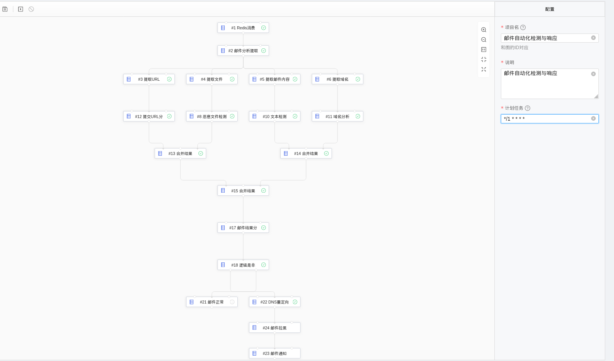

## 安全编排自动化与响应 (SOAR) - 钓鱼邮件技术解析

## 介绍

**钓鱼邮件技术解析** 使用 XXSOAR 平台集成能力，针对网络钓鱼邮件的解决方案以及技术分析。

### 场景预览

### 技术解析
1. 应用商店微服务
2. 编排集成能力
3. 自动化响应

    利用以上能力将不同系统之间的交互流转（数据源，数据处理，威胁检测，防护处置），变的可复用且自动化

使用到的应用微服务（具体参考场景预览图）

1. 数据源-Redis
2. 提取邮件内容组建（提取URL，文件，邮件内容，包含域名）
3. 检测模块（URL分析，恶意文件分析，文本检查，域名分析）
4. 工具包（合并收集结果）
5. 结果分析判定分析结果（邮件是否危险）
6. 邮件处置（DNS重定向，邮件拉黑，通知收件人...）

#### 推荐阅读
[# 安全编排自动化与响应 (SOAR)](https://github.com/xxwsy/xxsoar)

[# Nuclio - "Serverless" for Real-Time Events and Data Processing](https://github.com/nuclio/nuclio)

### 联系我们

