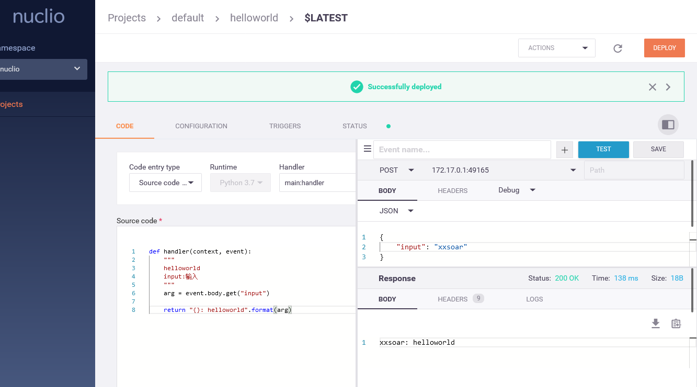

# Nuclio - "Serverless" 从0开始构建自己得函数吧

## 访问Serverless服务
```
http:/localhost:8070
```
1. 点击 NEW FUNCTION
2. 进入如下页面
- 1. Start from scratch
- 2. 输入函数名 Name
- 3. 选择Runtime
- 4. CREATE


3. 进入如下页面
- 1. Source code 区域编写代码，请注意注释格式，第一行为xxsoar中显示的组件名称，第二行开始是xxsoar编排过程中的参数
```
    """
    helloworld
    input:输入
    input2:输入2
    """
```
- 2. 抄完代码后，点击DEPLOY，等待显示 Successfully deployd，部署完成
- 3. 测试，按下图选择JSON传参，抄上参数，点击 TEST
- 4. OK，可以开始进入xxsoar之旅
- 5. 福利，项目中functions目录是友情提供的，可以从上图的Import直接导入


